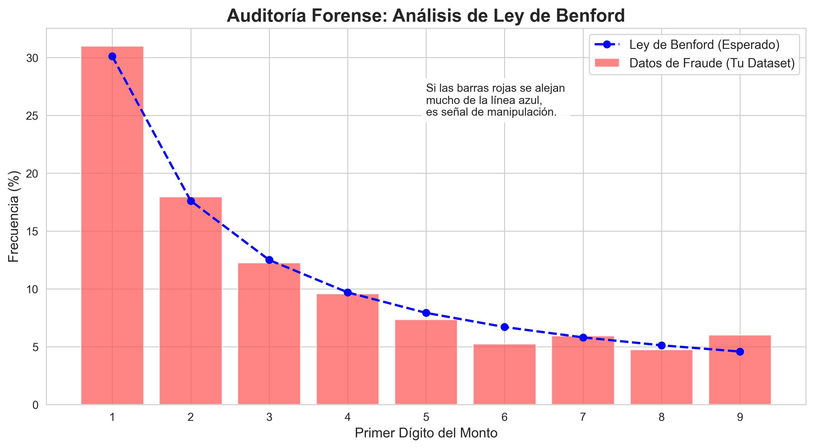
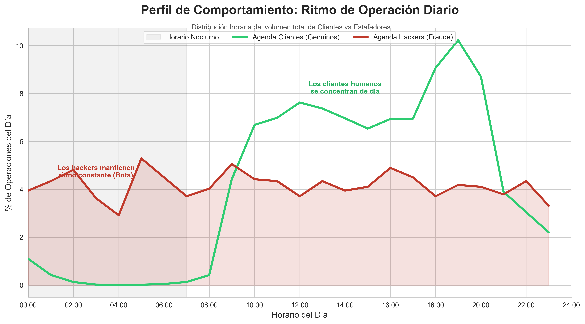
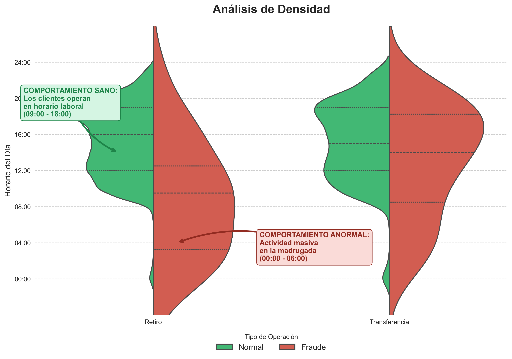
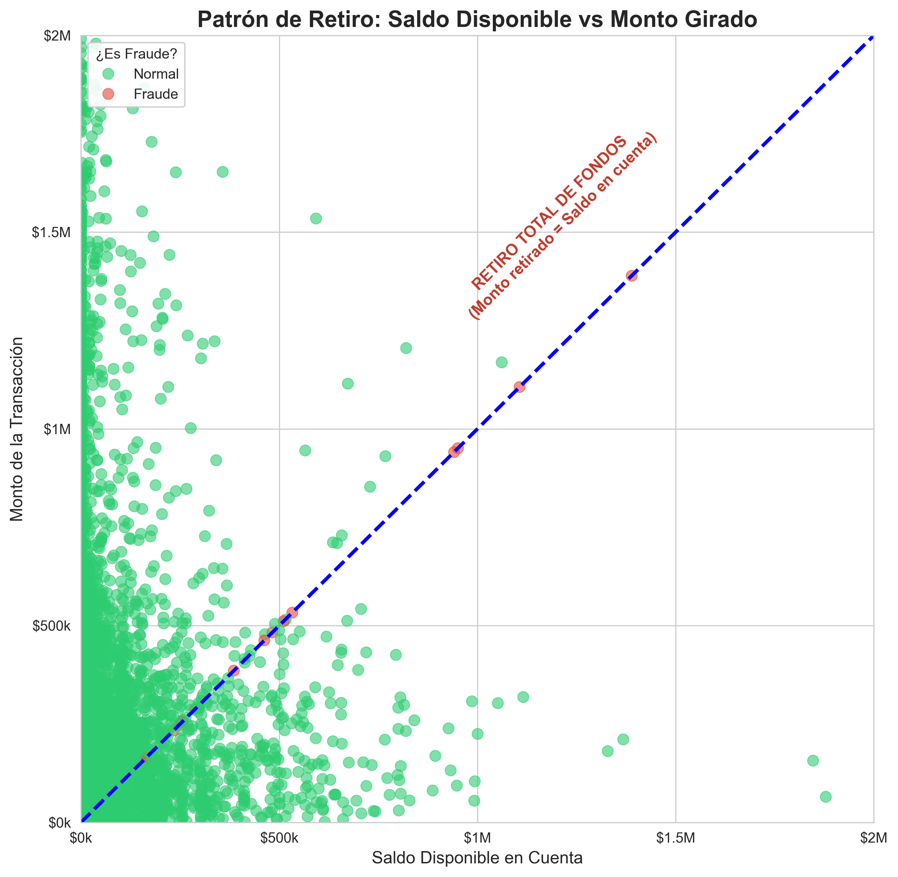
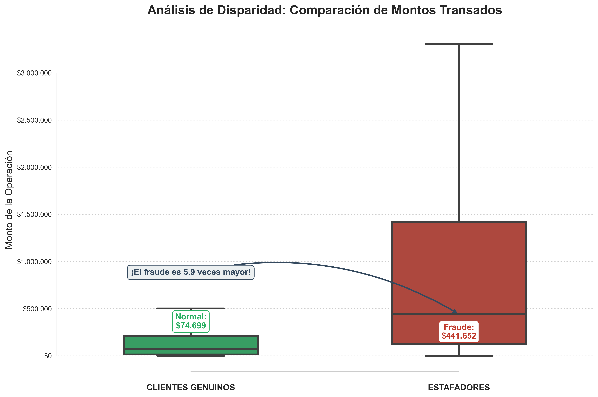

# Analisis Fraude Bancario

**Rol:** Analista de Datos

**Herramientas:** Python (Pandas, Seaborn, MatplotLib), SQL, Power BI, DAX.

## Origen y Arquitectura de Datos

Este proyecto se basa en una simulación entorno bancario chileno, combinando datos públicos con ingeniería de datos propia.

1.  **Fuente Transaccional (Kaggle):**
    *   Se utilizó el dataset *PaySim Mobile Money*, un estándar global para la investigación de fraude financiero que contiene millones de logs de transacciones móviles.
    
2.  **Enriquecimiento de Datos (Python & Faker):**
    *   Dado que el dataset original es anónimo, **desarrollé un script en Python** para generar una base de datos dimensional de clientes ("Dim_Clientes").
    *   Se simularon atributos demográficos específicos de Chile: **RUT, Regiones geográficas, Edad y Bancos locales** (BancoEstado, Santander, Falabella, etc.).

3.  **Modelado (Esquema Tipo Estrella):**
    *   Ambos datasets fueron cruzados y transformados para crear un modelo relacional (Hechos y Dimensiones) optimizado para el análisis en Power BI.
  

## Resumen Ejecutivo
Este proyecto simula el ciclo de vida completo de un analista de datos en el sector bancario. El objetivo fue auditar un dataset transaccional, detectar patrones anómalos mediante estadística y automatizar un sistema de monitoreo de riesgos.

El resultado es una **Solución de Monitoreo Ejecutivo en PowerBI** que transforma datos crudos en estrategias de mitigación, permitiendo a la gerencia visualizar pérdidas financieras y detectar anomalías críticas en tiempo real.

## Hallazgos Clave del Análisis
Para diseñar el dashboard final, primero realicé una investigación profunda en Python para entender **cómo** operan los defraudadores.

### 1. El indicio inicial: Ley de Benford
Partí validando la integridad de los datos. Al comparar los dígitos de los montos con la distribución estándar de Belford, noté discrepancias que indican que **los montos no siguen un comportamiento económico natural**, una señal típica de cifras inventadas o manipuladas por terceros.

### 2. Perfil de Comportamiento
Al analizar el horario de las transacciones encontré un patrón clave. A diferencia de los **clientes legítimos** que reducen su actividad en la noche, el fraude mantiene un volumen constante y parejo **durante el día y la madrugada**, lo que sugiere el uso de **Bots automatizados operando 24/7**.

### 3. Análisis de Densidad (Violin Plot)  
Confirmé el hallazgo anterior con un gráfico de densidad. La **alta concentración** en la zona roja inferior evidencia una actividad masiva entre las 00:00 y 06:00, un horario anómalo para realizar transferencias.

### 4. Segmentación del Riesgo Operativo
Al segmentar por tipo de operación, descubrí que el fraude se concentra **exclusivamente** en los canales de salida de fondos (Transferencia y Retiro). Los depósitos y pagos directos no presentan incidentes, lo que permite focalizar la auditoría y las reglas de bloqueo solo donde existe riesgo real.

### 5. Análisis de Modus Operandi: Retiro Total de Fondos
Este fue el hallazgo más crítico. Identifiqué una correlación perfecta ($R^2=1$) entre el saldo disponible y el **monto defraudado**. El patrón revela que, previo al fraude, se consulta el saldo exacto para realizar un retiro total de los fondos (Puntos sobre la línea punteada).

### 6. Análisis de Disparidad: Comparación de Montos Transados
Al comparar las medianas, se evidenció que el monto defraudado es **casi 6 veces superior** al de una transacción legítima. Esto indica que el patrón de fraude se caracteriza por **operaciones de montos significativamente más altos**.

## La Solución: Centro de Monitoreo en Power BI

Basado en los hallazgos anteriores, diseñé un Dashboard ejecutivo que permite:

1.  Alertar sobre operaciones nocturnas (Donut Chart).
2.  Identificar geográficamente las zonas de ataque (Mapa de Chile).
3.  Monitorear la evolución de pérdidas por Banco (Cintas).

## Estructura del Proyecto

*   `/src`: Scripts de Python para la generación de datos demográficos (Faker) y el proceso ETL.
*   `/notebooks`: Jupyter Notebook con el análisis estadístico y visualizaciones avanzadas.
*   `/dashboard`: Archivo `.pbix` con el modelo estrella y medidas DAX.
*   `/data`: Muestras de los datasets procesados (Fact_Transacciones y Dim_Clientes)

##  Cómo reproducir
1. Clonar el repositorio.
2. Instalar dependencias: `pip install -r requirements.txt`
3. Correr el script ETL: `python src/pipeline_final.py`.
4. Abrir el archivo Power BI y actualizar origen de datos.
